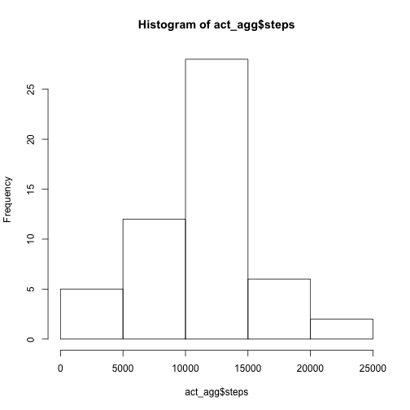

# Reproducible Research: Peer Assessment 1
This  assumes that the data file is unzipped as activity.csv 
It also assumes that you have knitr installed as well as lattice
## Loading and preprocessing the data

```r
act<-read.csv("activity.csv")
```


## What is mean total number of steps taken per day?
See below for histogram, mean and median

```r
act_agg<-aggregate( steps~date, act, sum)
hist(act_agg$steps) 
```

 

```r
mean(act_agg$steps)
```

```
## [1] 10766
```

```r
median(act_agg$steps)
```

```
## [1] 10765
```

## What is the average daily activity pattern?
See below for plot of intervals and the interval with most activity. 


```r
act_interval_agg<-aggregate( steps~interval, act, mean)
plot(act_interval_agg$interval,act_interval_agg$steps, type="l", ylab="Average Number of Steps Taken", xlab="")
```

 

```r
act_interval_agg[order(act_interval_agg[,2], decreasing=T)[1],1]
```

```
## [1] 835
```

## Imputing missing values
These are the number of complete cases. 
The strategy was to use the step mean across all days for the missing interval to fill in the means
The values are slightly higher, but the difference seems neglible for the
strategy used. 

```r
sum(complete.cases(act)==TRUE)
```

```
## [1] 15264
```

```r
incompletes<-which(!complete.cases(act))
fixed_act<-act
for (i in incompletes) {interval<-act[i,3]; stepsMean<-act_interval_agg[act_interval_agg$interval==interval,2]; fixed_act[i,1]<-stepsMean; }
fixed_act_agg<-aggregate( steps~date, fixed_act, sum)
hist(fixed_act_agg$steps)
```

 

```r
mean(fixed_act_agg$steps)
```

```
## [1] 10766
```

```r
median(fixed_act_agg$steps)
```

```
## [1] 10766
```

## Are there differences in activity patterns between weekdays and weekends?
On the weekend, people tend to walk less in the morning. That's what the data shows. 

```r
weekdays_fixed_act$time_of_week<-factor(weekdays(as.Date(weekdays_fixed_act$date)) %in% c("Saturday", "Sunday")) 
levels(weekdays_fixed_act$time_of_week)[levels(weekdays_fixed_act$time_of_week)=="TRUE"]<-"weekend"
levels(weekdays_fixed_act$time_of_week)[levels(weekdays_fixed_act$time_of_week)=="FALSE"]<-"weekday"
library(lattice)
xyplot(weekdays_fixed_act$steps~weekdays_fixed_act$interval|weekdays_fixed_act$time_of_week, ylab="Number of Steps", xlab="Interval", type="l", layout=c(1,2))
```

 

